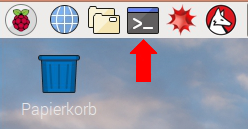

Dein Raspberry Pi muss mit dem Internet verbunden sein, um Pakete zu installieren. Bevor du ein Paket installierst, muss Raspbian, dein Raspberry Pi Betriebssystem, aktualisiert werden.

+ Öffne ein Terminalfenster und gib folgende Befehle ein, um das zu tun:



```bash
sudo apt-get update
sudo apt-get upgrade
```

+ Jetzt kannst du das von dir benötigte Paket installieren, indem du `install`-Befehle in das Terminalfenster eingibst. Hier ist ein Beispiel, wie du die Sense HAT Software installierst:

```bash
sudo apt-get install sense-hat
```
