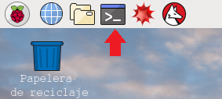

Tu Raspberry Pi debe estar en línea (con conexión a internet) para poder instalar el software. Antes de instalar el software, utiliza los comandos update y upgrade para actualizar el sistema operativo Raspberry Pi.

+ Para hacer esto, abre una ventana del terminal e introduce los siguientes comandos:



```bash
sudo apt-get update
sudo apt-get upgrade
```

+ Ahora puedes instalar el software que necesites escribiendo los comandos `install` en la ventana del terminal. Por ejemplo, así se instalaría el software Sense HAT:

```bash
sudo apt-get install sense-hat
```
